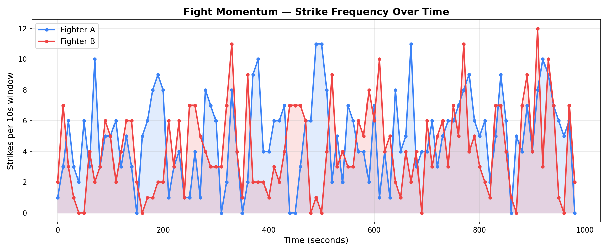

# 🥊 fight-vision

> Real-time computer vision pipeline for combat sports analytics — fighter detection, pose estimation, strike validation, and momentum tracking using YOLOv8.


---

## What it does

fight-vision takes raw fight footage and converts it into structured performance metrics — automatically, frame by frame.

**Input:** Raw fight video (.mp4)

**Output:**
- Annotated video with bounding boxes, pose keypoints, live strike counter, and stance labels per fighter
- Momentum graph showing strike frequency per fighter over time (see below)
- Console summary of total validated strikes

---

## Momentum Graph — Real Output

Fight analyzed over ~1000 seconds. Blue = Fighter A, Red = Fighter B.
Peaks show periods of striking dominance. Overlapping regions indicate competitive exchanges.



---

## Pipeline

```
Video → ROI Crop → YOLOv8 Detection → Centroid Tracking
     → YOLOv8-Pose Estimation → Strike Validation → Time Bucketing → Momentum Graph
```

Each frame goes through 9 stages:

| Stage | What happens |
|-------|-------------|
| 1. ROI extraction | Crops octagon area using percentage-based coordinates — resolution-independent |
| 2. Person detection | YOLOv8n detects fighters, filters by class=0 (person), conf ≥ 0.4 |
| 3. Identity tracking | Centroid-based assignment keeps Fighter A/B labels consistent across frames |
| 4. Pose estimation | YOLOv8n-pose returns 17 COCO keypoints per fighter from their individual crop |
| 5. Stance detection | Compares ankle-to-opponent distance; majority vote over 15 frames for stability |
| 6. Standing check | Hip vertical displacement filter removes grappling and takedown frames |
| 7. Strike validation | 3-condition gate: velocity + direction + proximity (see below) |
| 8. Cooldown enforcement | 0.8s minimum between strikes prevents double-counting |
| 9. Time bucketing | Strikes grouped into 10s windows → momentum graph |

---

## Strike Validation Logic

A strike is counted only when **all 3 conditions pass** for either wrist (COCO keypoints 9/10):

| # | Condition | Implementation |
|---|-----------|----------------|
| 1 | **Velocity** | `euclidean_distance(prev_wrist, curr_wrist) >= 18px` |
| 2 | **Direction** | `dist(curr_wrist, opp_center) < dist(prev_wrist, opp_center)` |
| 3 | **Proximity** | Wrist coordinates fall inside opponent bounding box |

This multi-constraint approach reduces false positives from guard adjustments, feints, and model noise. Posture validation (hip stability check) runs before strike validation to filter grappling frames.

---

## Tech Stack

| Library | Version | Role |
|---------|---------|------|
| `ultralytics` | 8.1.47 | YOLOv8 person detection + pose estimation |
| `opencv-python` | 4.9.0 | Video I/O, frame processing, drawing overlays |
| `numpy` | 1.26.4 | Array math — distance, velocity, keypoint operations |
| `matplotlib` | 3.8.4 | Momentum graph generation |

---

## Project Structure

```
fight-vision/
├── main.py                      # entry point
├── config.py                    # all tunable parameters — thresholds, paths, ratios
├── requirements.txt
├── Dockerfile                   # containerized deployment
├── .github/workflows/ci.yml     # CI pipeline — syntax check, structure validation, Docker build
├── src/
│   └── video/
│       ├── loader.py            # core pipeline — detection, pose, strike logic, output
│       ├── frame_extractor.py   # utility — save individual frames as timestamped JPEGs
│       └── utils.py             # pure helpers — geometry, drawing (no side effects)
├── assets/
│   └── momentum_graph.png       # real output from pipeline run
├── data/raw/                    # place fight video here (gitignored)
└── outputs/                     # generated video and graph (gitignored)
```

---

## Setup

```bash
git clone https://github.com/Sami-codexs/fight-vision.git
cd fight-vision
pip install -r requirements.txt
```

Download model weights from Ultralytics and place in project root:
```
yolov8n.pt
yolov8n-pose.pt
```

Place your fight video:
```
data/raw/fight_01.mp4
```

Run:
```bash
python main.py
```

---

## Docker

```bash
# Build
docker build -t fight-vision .

# Run
docker run \
  -v $(pwd)/data:/app/data \
  -v $(pwd)/outputs:/app/outputs \
  fight-vision
```

---

## Configuration

All tuning parameters live in `config.py`:

```python
WRIST_SPEED_THRESH = 18    # min pixels/frame for strike velocity check
HIP_DROP_THRESH    = 20    # max hip displacement to confirm standing posture
STRIKE_COOLDOWN    = 0.8   # seconds between valid strikes per fighter
STANCE_HISTORY     = 15    # frames used for stance majority vote
BUCKET_SIZE        = 10    # seconds per momentum graph window
START_FRAME        = 0     # start processing from this frame
```

---

## Limitations

- CPU inference runs at ~3-5 FPS. GPU required for real-time use.
- Rule-based strike detection — not a learned classifier.
- No advanced re-identification — identity swaps can occur during clinches.
- Pose accuracy degrades under heavy occlusion or extreme camera angles.

---

## Future Improvements

- [ ] GPU acceleration for real-time inference
- [ ] FastAPI endpoint — POST video, receive JSON strike analytics
- [ ] DeepSORT tracking for robust fighter re-identification
- [ ] Strike type classification (jab, cross, hook, kick)
- [ ] Hugging Face Spaces live demo
- [ ] Fine-tune YOLOv8 on labeled combat sports dataset

---

*Built with Python · OpenCV · Ultralytics YOLOv8*
